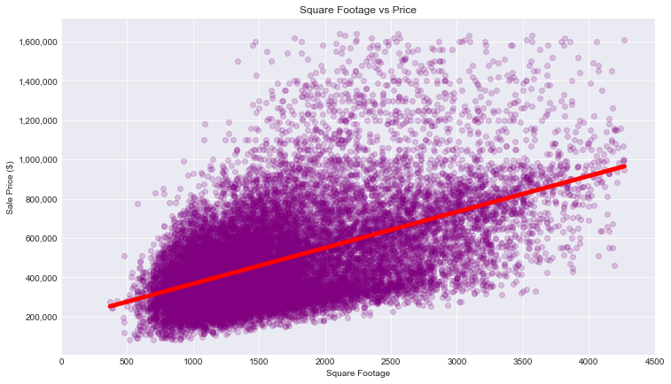
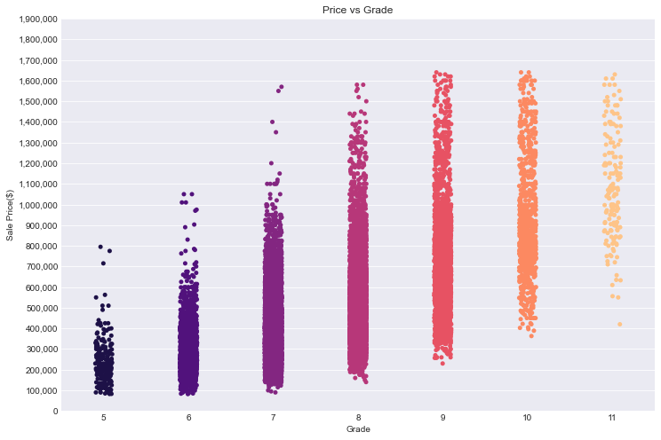

# Renovation Recommendations For Optimizing King County Home Values
## Using Multiple Regression To Increase Home Prices

**Authors**: Robert Cauvy

The contents of this repository detail an analysis of the module two project. This analysis is detailed in hopes of making the work accessible and replicable.


### Business problem:

King County Residents want to renovate their home to increase its resale value but don't know what factors are important for determining a home's value.
The ACME Real Estate Advisory will provide the client with three things they can do to their property that can increase their property resale value the most.


### Data:
This project will leverage a data set containing sale prices of homes in King County, WA to advise homeowners decide which renovation projects would increase the resale potential of their home.

The data spans just over year, from May 2014 to 2015 and includes over 20,000 house sales.

Since our clients are most concerned with increasing their home's resale value Price will be used as the target variable, and will explore all of the other features of the dataset as predictor variables. These independent features include square footage, grade, condition, and number of bedrooms and bathrooms.

## Results


#### Square Footage vs Sale Price


> Here is the linear relationship between square footage and home sale price. Every square foot added to a house can increase the homes value.

#### Home Sale Prices vs Grade


> Of all the features of a home that can be controlled by home owners. Increasing Grade can have the largest impact. This visualization demonstrates how moving up grades relate to increased home values.

#### Home Sale Price vs Basement vs Sqft


> This visualization displays how homes with a basement have tend to have a higher value. Square footage and price are highly correlated so this graphic also shows that homes with a similar square footage can be worth more if they also have a basement.

#### Average Home Prices vs Number of Bathrooms


> Adding a full or half bath can significantly increase the value of a home.

## Recommendations:

Even though not all features of a home are controllable by the homeowner it is important that they are included in the model. This allows the model to reach its largest R-squared value, which can in turn explain the variance in the dependent variable that the independent variables explain collectively. From there we can take the largest coefficients of the features that can be changed (ie bedrooms, bathrooms, square footage, condition, etc.).

The results of the best performing model suggests that the three most salient renovations King County homeowners can do to increase the resale value of their homes are:

Increasing grade
Adding a bathroom
Adding a basement
It's also worth noting increasing the square footage above ground can increase a home's value $116 - $105 per square foot.

## Limitations & Next Steps

Given more time and information about what the homeowner's renovation budget would be, we would have wanted to analyze whether these top 3 parameters would truly be the most effective in bringing a net value increase since a renovation such as adding a basement to a home would be very costly and may not end up returning a net value increase. Additionally, the construction costs in the state of Washington may be higher than other states due to factors such as permitting, material costs, logistical challenges etc. which may effect the net value increase as well. Furthermore, having information about whether the homeowner is thinking about living in the renovated house or renting it out would allow us to fine tune our analysis and bring more valuable insight.


### For further information
Please review the narrative of our analysis in [our jupyter notebook](./index.ipynb) or review our [presentation](./SampleProjectSlides.pdf)

For any additional questions, please contact **rcauvy@gmail.com)


##### Repository Structure:

Here is where you would describe the structure of your repoistory and its contents, for exampe:

```

├── README.md               <- The top-level README for reviewers of this project.
├── index.ipynb             <- narrative documentation of analysis in jupyter notebook
├── presentation.pdf        <- pdf version of project presentation
└── images
    └── images               <- both sourced externally and generated from code
└── data
    └──

```
